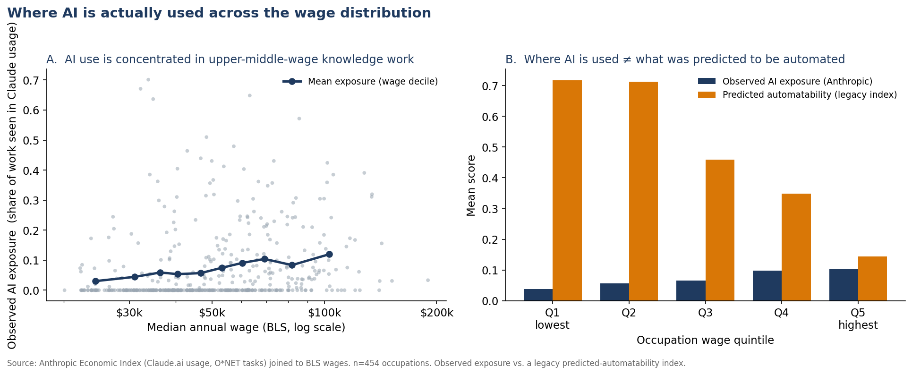

# Where AI Is Actually Used Across the Wage Distribution

A short, reproducible empirical note joining the **Anthropic Economic Index** (observed AI
use by occupation, derived from real Claude.ai conversations mapped to O\*NET tasks) to
**BLS occupational wages**, and contrasting it with a legacy *predicted*-automatability index.

**Headline:** Where generative AI is *actually* used looks almost nothing like what a decade
of "automation risk" forecasts predicted. Observed AI exposure **rises** with wages and
concentrates in upper-middle-wage knowledge and clerical work; the legacy automatability
score **falls** with wages. The two are near mirror images.



## Key findings (n = 454 of the index's 756 occupations)

| Wage quintile | Median wage | Observed AI exposure | Predicted automatability (legacy) |
|---|---|---|---|
| Q1 (lowest) | $27,730 | 0.037 | 0.717 |
| Q2 | $38,750 | 0.056 | 0.712 |
| Q3 | $49,500 | 0.066 | 0.459 |
| Q4 | $63,340 | 0.098 | 0.348 |
| Q5 (highest) | $92,250 | 0.102 | 0.144 |

The two right-hand columns do not share a denominator: the legacy score is missing for 73 of the
454 occupations, and the gaps cluster in the top two quintiles (non-null counts by quintile: 81,
82, 83, 68, 67).

- Observed AI exposure and wages are **positively** related (Spearman ρ = 0.33, p < 10⁻¹²).
- Across **all classified Claude.ai conversations** in the release — a platform-wide figure, not one computed within these occupations — **57% is augmentation** (learning, iteration, validation) vs **43% automation** (directive, feedback-loop).
- The most AI-exposed occupations are cognitive/clerical: **Customer Service Representatives (0.70)**, Data Entry Keyers (0.67), Market Research Analysts (0.65), Medical Transcriptionists (0.64), Financial Analysts (0.57).

> **Coverage.** 302 of the index's 756 occupations have no row in the legacy wage table and are
> dropped by the join. They are on average *more* AI-exposed than the 454 kept (0.084 vs 0.072),
> and include the most-exposed occupation in the whole index. Reported levels are therefore a
> lower bound. Full accounting in [`findings.md`](findings.md#coverage-and-selection).

See [`findings.md`](findings.md) for the full write-up, interpretation, and caveats.

## Reproduce

```bash
pip install -r requirements.txt
# Data are public (CC-BY / public domain) — see data/SOURCES.md for the two source files.
python analysis.py        # prints stats, writes results.json and figures/
```

## Contents
- `analysis.py` — load, join, analyze, plot (single file, ~130 lines)
- `data/` — input CSVs + `SOURCES.md` provenance
- `findings.md` — research note (question → method → findings → caveats)
- `results.json` — machine-readable results

## Data
- **Anthropic Economic Index** (Feb 2025 release): `job_exposure.csv` (observed AI exposure by SOC occupation) and `automation_vs_augmentation.csv`. CC-BY. <https://huggingface.co/datasets/Anthropic/EconomicIndex>
- **Wages + legacy automatability**: `wage_data.csv` (BLS median wages by occupation; legacy automation-probability index). Public.

The code in this repository is MIT licensed. The input datasets in `data/` are
redistributed under their own licences, as listed above and in
[`data/SOURCES.md`](data/SOURCES.md).

## Cite

See [`CITATION.cff`](CITATION.cff), or use GitHub's **Cite this repository** button.

*Author: Brendan Daly · June 2026. Built as a small empirical artifact; all figures regenerate from public data. The repository itself is the artifact; use GitHub's **Code → Download ZIP** for a snapshot.*
